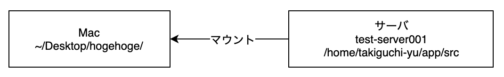

# `sshfs` + `osxfuse` で Mac にサーバ上のディレクトリをマウント

## はじめに
仕事をしていると往々にしてサーバ上のファイルを直接いじりたい場面があると思います。  
そんなときに便利なのが、 `sshfs` です。
サーバのディレクトリをローカルにマウントすることができるので、自分の好きなエディタで開発することができます。  
ちなみに osxfuse は Mac のファイルシステムを操作するためのライブラリです。

## 環境
- Mac(Mojave)
- [Homebrew](https://brew.sh/index_ja )



## インストール
```bash
brew cask install osxfuse
brew install sshfs
```

## マウント
```bash
# sshfs [ユーザー名]@[ホスト名]:[ディレクトリ] [ローカルのマウントしたい場所]
sshfs takiguchi-yu@test-server001:/home/takiguchi-yu/app/src/ ~/Desktop/hogehoge/
```

## アンマウント
```bash
diskutil unmount force ~/Desktop/hogehoge/
```

## 最後に
パソコンを閉じるとマウントが切れてしまうため、自動化したい。  
マウントが切れたときは、アンマウント→マウントし直すと直ります。
