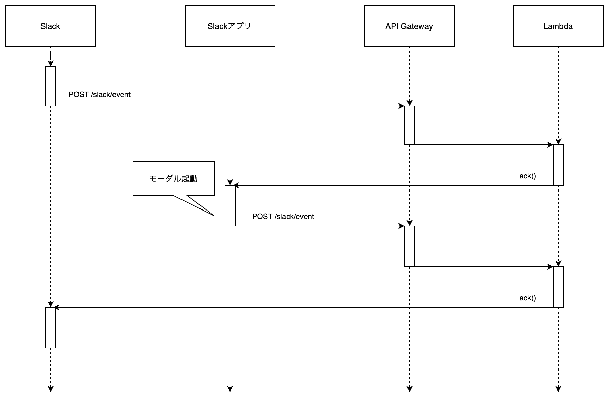

# Slack アプリを AWS Lambda で動かす

## やること

Slack アプリを `AWS Lambda` で動かす。  
Slack アプリは `Slack Bolt` で開発し、Slackのショートカットからモーダルを起動する。  

## [Slack Bolt](https://slack.dev/bolt-js/ja-jp/tutorial/getting-started) とは？

Slack アプリを手軽に作成するためのフレームワークで、Slack 社が提供している。Bot だけを作れるとかそういうわけではなく、色々なトリガーからアプリを起動させて色々な処理をさせることができる。トリガーは以下の通り。

- Webhook 起動
- ショートカット起動（イナズママークのやつ）
- スラッシュコマンド起動

また、[BlockKitBuilder](https://app.slack.com/block-kit-builder/) を使えば、よりリッチな UI を実現することができる。

## シーケンス



## 開発言語
- Node.js 12.16.1

## 依存関係のある npm パッケージ

- @slack/bolt 2.2.3
- @slack/logger 2.0.0
- aws-serverless-express 3.3.8

## 開発環境のみの npm パッケージ

- serverless 1.78.1
- serverless-offline 6.5.0

## 実装内容

```js
// ------------------------
// Bolt 初期化処理
// ------------------------
const { App, ExpressReceiver } = require('@slack/bolt');
const { LogLevel } = require('@slack/logger');
const logLevel = process.env.SLACK_LOG_LEVEL || LogLevel.DEBUG;
const processBeforeResponse = false;

const receiver = new ExpressReceiver({
  signingSecret: process.env.SLACK_SIGNING_SECRET,
  processBeforeResponse,
});

const app = new App({
  token: process.env.SLACK_BOT_TOKEN,
  logLevel,
  receiver,
  processBeforeResponse,
});

// ------------------------
// Bolt メイン処理
// ------------------------

// ショートカット起動
app.shortcut('{callback_id}', async ({ logger, client, body, ack }) => {
  // logic...
  await ack();
});

// レスポンス処理
app.view('{callback_id}', async ({ logger, client, body, ack }) => {
  // logic...
  await ack();
});

// ------------------------
// AWS Lambda ハンドラ
// リクエストを受け付けたらExpressサーバを起動する
// ------------------------
const awsServerlessExpress = require('aws-serverless-express');
const server = awsServerlessExpress.createServer(receiver.app);
module.exports.hello = (event, context) => {
  awsServerlessExpress.proxy(server, event, context);
};
```

## Slack アプリ作成

アプリは、以下から作成できる。

https://api.slack.com/apps/new

## Slack アプリ設定

アプリをショートカット起動する場合は、以下から設定する。「Callback ID」は ソースコードの app.shortcut('{`callback_id`}'〜 と一致させる。

https://api.slack.com/apps/{作成したアプリID}/interactive-messages


## 実装のポイント

- Slack アプリはレスポンスを`3秒以内`を返さないとエラーになってしまうため、`ack()` をどのタイミングで返すかがキモになってくる。3 秒を超えるような処理を実装する場合は Lambda を分割し先に ack() をしてから、一方の Lambda を非同期処理させると良いかと思う。
- BlockKitBuilder の JSON と app.view の `callback_id` が紐づいているので、view が開かないと思ったら `callback_id` を確認すると良い。
- BlockKitBuilder の JSON に `block_id` と `action_id` を指定すれば、リクエストを input ごとに取得することできる。

## さいごに

Lambda で Bolt を動かす場合、Lambda 起動+Bolt 起動の時間が乗ってくるため、結構シビア。Lambda で動かすよりも普通にサーバで Bolt を動かした方が何かと考えることが少なく済むので良い。

## 参考になったURL

- https://github.com/seratch/bolt-starter
- https://github.com/seratch/serverless-slack-bolt-aws
