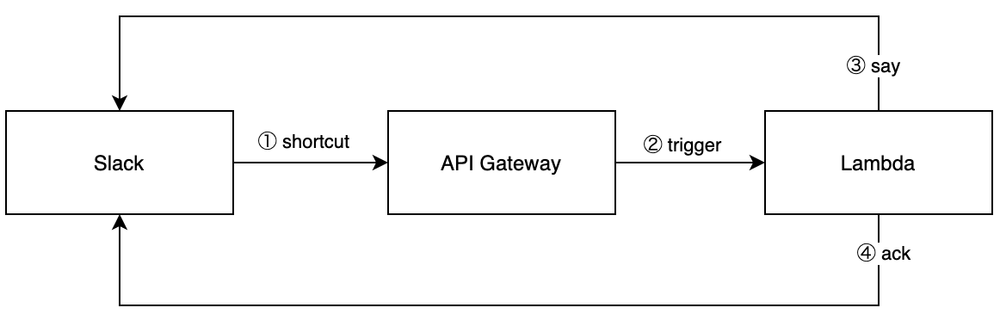

# Slack Bolt を AWS Lambda で動かすポイント

## やること

Slack アプリを `AWS Lambda` で動かす。  
Slack アプリは `Slack Bolt` で開発する。

## Slack Bolt って？

Slack アプリを手軽に作成するためのフレームワークである。Slack 社が提供している。  
Bot だけを作れるとかそういうわけではなく、色々なトリガーからアプリを起動させて色々な処理をさせることができる。

- Webhook 起動
- ショートカット起動（イナズママークのやつ）
- スラッシュコマンド起動

[Bolt 入門ガイド](https://slack.dev/bolt-js/ja-jp/tutorial/getting-started)

## 今回の構成イメージ



## 必要なパケッケージ

- @slack/bolt
- @slack/logger
- aws-serverless-express

## 実装内容

- handler.js

```js
// ------------------------
// Bolt App Initialization
// ------------------------
const { App, ExpressReceiver } = require('@slack/bolt');
const { LogLevel } = require('@slack/logger');
const logLevel = process.env.SLACK_LOG_LEVEL || LogLevel.DEBUG;
const processBeforeResponse = false;
const receiver = new ExpressReceiver({
  signingSecret: process.env.SLACK_SIGNING_SECRET,
  processBeforeResponse,
});
const app = new App({
  token: process.env.SLACK_BOT_TOKEN,
  logLevel,
  receiver,
  processBeforeResponse,
});

// ------------------------
// Application Logic
// ------------------------

// Shortcut Trigger
app.shortcut('{callback_id}', async ({ logger, client, body, ack }) => {
  try {
    const res = await client.views.open({
        "trigger_id": body.trigger_id,
        "view": // Paste the layout here. See https://app.slack.com/block-kit-builder/
    });
    logger.debug("views.open response:\n\n" + JSON.stringify(res, null, 2) + "\n");
    await ack();
  } catch (e) {
    logger.error("views.open error:\n\n" + e + "\n");
    await ack(`:x: Failed to open a modal due to *${e.code}* ...`);
  }
});

// Response
app.view('{callback_id}', async ({ logger, client, body, ack }) => {
  await say('Hi ' + body.user.name);
  await ack();
});

// ------------------------
// AWS Lambda handler
// ------------------------
const awsServerlessExpress = require('aws-serverless-express');
const server = awsServerlessExpress.createServer(receiver.app);
module.exports.hello = (event, context) => {
  awsServerlessExpress.proxy(server, event, context);
};
```

## Slack アプリ作成

アプリは、[ここ](https://api.slack.com/apps/new)から作成できる。

## Slack アプリ設定

[ここ](https://api.slack.com/apps/{アプリID}/interactive-messages)でよしなに設定する。  
Callback ID は handler.js の app.shortcut('{`callback_id`}'〜 と一致させる。

## 実装のポイント

- Slack アプリはレスポンスを`3秒以内`を返さないとエラーになってしまうため、`ack()` をどのタイミングで返すかがキモになってくる。3 秒を超えるような処理を実装する場合は Lambda を分割し先に ack() をしてから、一方の Lambda を非同期処理させると良いかと思う。
- view は、 `callback_id` に紐づいているので、view が開かないと思ったら `callback_id` を確認すると良いかと思う。
- view に `block_id` と `action_id` を指定すれば、個別の値を取得できる。

## さいごに

Lambda で Bolt を動かす場合、Lambda起動+Bolt起動の時間が乗ってくるため、結構シビア。普通にサーバでBoltを動かした方が何かと考えることが少なくて済むと思った。

記事の後半から雑になってきたので、不明点はコメントか、Github で！
