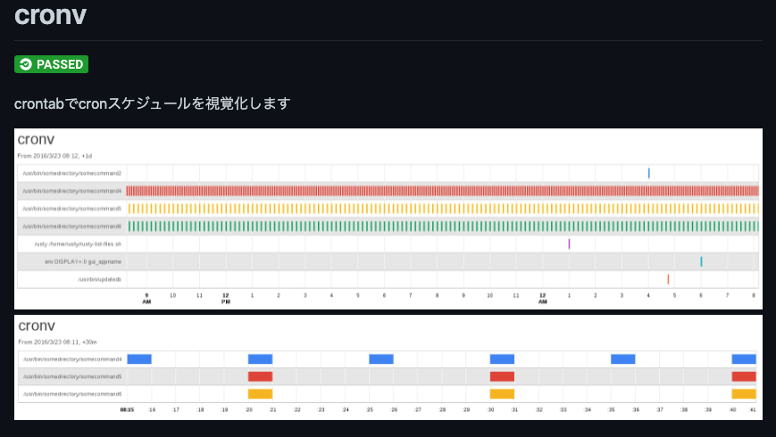
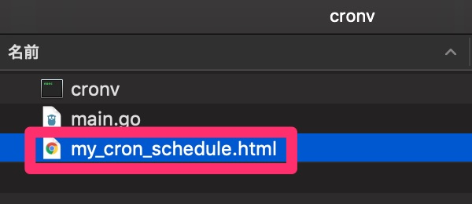
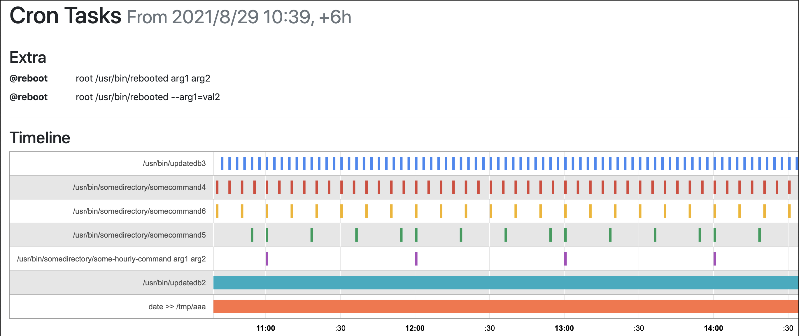

crontabの実行タイミング(スケジュール)を良い感じに可視化してくれるツールを探していたときに見つけた`cronv`を試してみます。

* https://github.com/takumakanari/cronv



# 環境
* MacOS

# goコマンドインストール

インストールはgoでビルドするようなので、まずはgoをインストール

```bash
$ brew install go
$ go version
go version go1.17 darwin/amd64
```

# cronvインストール

READMEとは少し違うのですが、以下のようにやったらインストールできました。

```bash
$ go get github.com/takumakanari/cronv/cronv
$ chmod -R +w ~/go
$ cd ~/go/pkg/mod/github.com/takumakanari/cronv@v0.5.0
$ go build -o ./cronv github.com/takumakanari/cronv/cronv
$ cd cronv
$ ./cronv --help
Usage:
  Cronv v0.4.1 [OPTIONS]
  :
```

# 試しに生成する

```bash
$ cd ~/go/pkg/mod/github.com/takumakanari/cronv@v0.5.0/cronv
$ cat ../example/crontab | ./cronv -o ./my_cron_schedule.html
$ open .
```

良い感じです。




細かいオプションもろもろは README にいろいろ記載があるため、そちらを参照してみてください。

以下、自分用メモ

```bash
# 2020/08/31 00:00 から 1日分 の crontab をビジュアライズ
cat ~/git/restaurant/crontab/batch_srv/crontab.txt | ./cronv -o ./batch_srv.html -w 180  --from-date '2020/08/31' --from-time '00:00' -d 1d --title batch_srv
```
