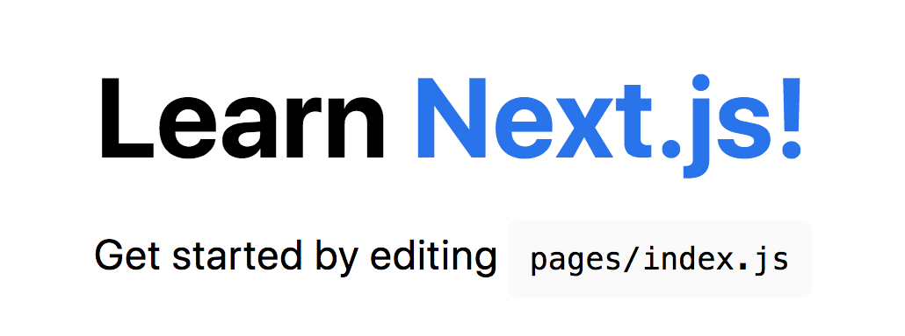
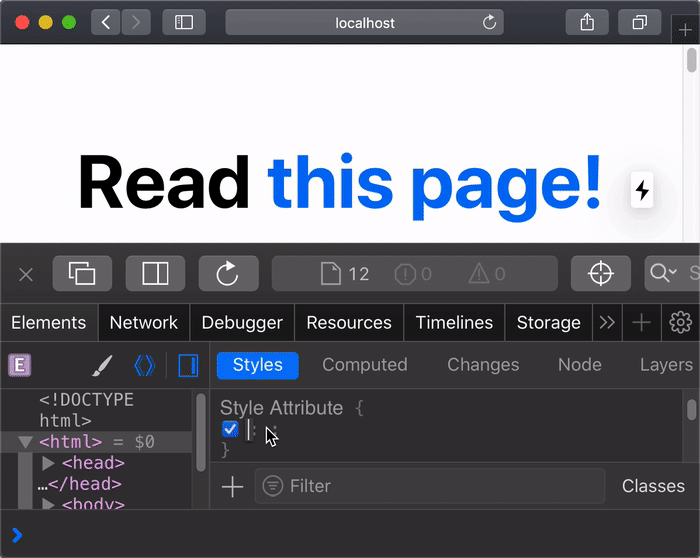

# SSR フレームワーク `Next.js` を使って `React` を快適ルーティング part1

## はじめに
- Next.js のチュートリアルをただ翻訳しながら紹介するだけです  
https://nextjs.org/learn/basics/create-nextjs-app
- Mac 前提です
- `Node.js` と `npm` を事前にインストールしてください

## Next.js とは
`Next.js` は `React` を使って SSR (サーバサイドレンダリング)アプリケーションを構築できる軽量フレームワークになります。  
すぐに使えるスタイルやルーティングのソリューションを含んでいるため、手軽にスタイルを適用したり、ページ遷移を実装することができます。  
サーバ環境としては、 `Node.js` を利用することが想定されています。

## SPA と SSR と React
通常 `React` 単体では すべての JS や CSS 、 HTML を一気に読み込むいわゆる `SPA` なので、初回アクセスが遅いといった問題があります。  
これを解決するために誕生したのが `SSR` であり、パフォーマンス改善の他、SEO に強くなるといった特徴があります。  
また、 `React` 単体でルーティングを実現しようとすると React Router が有名ですが、これはページ遷移のたびにブラウザリロードが走ってしまうため、パフォーマンスがよくありませんでした。`Next.js` ではそういった部分も改善されているため、ぜひ触ってみながら体験してみましょう。

## Next.js と Gatsby
Next.js は Gatsby と比較されることがよくありますが、 Gatsby はランディングページなどの静的Webサイトを構築するにはとても快適なのですが、ページが複数あるようなWebアプリケーションを構築するとなると Next.js の方に軍配が上がるのではないかと思います。  

## Next.js アプリを作成する

### Next.js アプリを作成する
```bash
npx create-next-app nextjs-blog --use-npm --example "https://github.com/vercel/next-learn-starter/tree/master/learn-starter"
```

### 開発サーバーを実行する
```bash
cd nextjs-blog
npm run dev
```

### Next.js へようこそ
ブラウザで http://localhost:3000/ にアクセスする


### ページの編集
`pages/index.js` を以下のように変更する  
ホットリロードが効いているので、ブラウザに即時反映されたかと思います。
```
“Welcome to”
↓
“Learn”
```


## 続く...

# SSR フレームワーク `Next.js` を使って `React` を快適ルーティング part2
前回の続きです。  
まだ、ページをちょこっと編集しただけなので、今回はアプリケーションにページを追加してみたいと思います。

## ページ間を移動する
### 新しいページを作成する
- 必要なファイルを作成する
```bash
mkdir pages/posts/
touch pages/posts/first-post.js
```

- first-post.js を編集する
```js
export default function FirstPost() {
  return <h1>First Post</h1>
}
```

- ブラウザで http://localhost:3000/posts/first-post にアクセスする


### リンクコンポーネントを使う
- `pages/index.js` を開く
- 以下を先頭行に追記する
```js 
import Link from 'next/link'
```
- 次に h1 タグの内容を変更する
```html
Learn <a href="https://nextjs.org">Next.js!</a>
↓
Read <Link href="/posts/first-post"><a>this page!</a></Link>
```
- 次に `pages/posts/first-post.js` を以下の通り書き換える
```js 
import Link from 'next/link'

export default function FirstPost() {
  return (
    <>
      <h1>First Post</h1>
      <h2>
        <Link href="/">
          <a>Back to home</a>
        </Link>
      </h2>
    </>
  )
}
```

- 動作確認しよう


### クライアント側のナビゲーション
クライアント側のナビゲーションとは、ページ遷移がJavaScriptを使用して行われることを意味します。これは、ブラウザが行うデフォルトのナビゲーションよりも高速です。

開発者ツールを使って html 全体の背景を設定してみましょう。  
黄色の背景がページ遷移しても持続していることが分かります。

これは、<u>ブラウザがページ全体を読み込まず</u>、クライアント側のナビゲーションが機能していることを示しています。



## コード分割とプリフェッチの話
Next.js は自動的にコード分割を行うので、各ページはそのページに必要なものだけをロードします。  
つまり、ホームページがレンダリングされるとき、<u>他のページのコードは読み込まれない</u>ことを意味します。  
これは大変素晴らしいですね！  
これにより、数百ページを追加した場合でも、ホームページがすばやく読み込まれます。

リクエストしたページのコードをロードするだけでも、ページが分離されます。  
特定のページがエラーをスローしても、アプリケーションの残りの部分は引き続き機能します。

さらに、Next.jsのプロダクションビルドでは、Linkコンポーネントがブラウザのビューポートに表示されるたびに、Next.js がバックグラウンドでリンクされたページのコードを自動的にプリフェッチします。リンクをクリックするまでに、<u>リンク先ページのコードはすでにバックグラウンドで読み込まれており、ページ遷移はほぼ瞬時に行われます！</u>

今回使った `Link` コンポーネントの詳細はこちらを参照ください。

https://nextjs.org/docs/api-reference/next/link

## 続く...